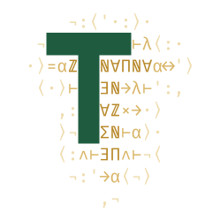

<p align="center">
  
</p>

<h1 align="center">ledger</h1>

<p align="center">
  <em>A usage ledger in Lean 4: the arithmetic and the hold lifecycle are proven in Lean, concurrency is left to Postgres.</em>
</p>

<p align="center">
  <a href="https://github.com/typednotes/ledger/actions/workflows/lean_action_ci.yml"></a>
  <a href="https://github.com/typednotes/ledger/actions/workflows/docker-publish.yml"></a>
  <a href="https://github.com/typednotes/ledger/pkgs/container/ledger"></a>
  <a href="https://github.com/typednotes/ledger/tags"></a>
  <a href="https://lean-lang.org/"></a>
  <a href="https://github.com/typednotes/linen"></a>
  <a href="LICENSE"></a>
</p>

---

`ledger` is the `typednotes` usage-ledger service. It records
`usage_events` and keeps a `credit_ledger` balance, bounded by
`credit_holds` and credited by idempotent grants keyed on
`credit_ledger.idempotency_key`. The balance arithmetic and the hold
lifecycle are proven in Lean.

One property is not proven here: that two concurrent holds can never
together overspend a balance. It could be stated in Lean, but reserves are
SQL statements that other services send directly to Postgres, so no Lean
code is involved in executing them. The property is left to Postgres, with
a known gap described under [Guarantees](#guarantees).

This service is specified in
[`typednotes/typednotes`](https://github.com/typednotes/typednotes/tree/main)'s
[`docs/services/ledger.md`](https://github.com/typednotes/typednotes/blob/main/docs/services/ledger.md) and is built on
[`linen`](https://github.com/typednotes/linen/tree/main).

## Table of contents

- [Features](#features)
- [Role](#role)
- [Guarantees](#guarantees)
- [How it fits together](#how-it-fits-together)
- [Quick start](#quick-start)
- [Configuration](#configuration)
- [HTTP API](#http-api)
- [Database schema](#database-schema)
- [Project layout](#project-layout)
- [Docker](#docker)
- [License](#license)

## Features

- **Balance arithmetic**: `Credits := Nat`, `Micros := Int`, the
  `credit_ledger` row type with `balance`, and the `balance_append` theorem.
- **Typed hold lifecycle**: `HoldStep` and `Settlement` make an illegal
  transition (anything out of `.settled` or `.released`) unrepresentable.
- **Single-statement reserves**: one conditional insert, never a
  read-then-write in application code. Race-free only under `SERIALIZABLE`
  isolation for now; see [Guarantees](#guarantees).
- **Idempotent grants**: `insert into credit_ledger ... on conflict
  (idempotency_key) do nothing`, with the welcome-grant key
  `welcome:{org_id}`, so retries are safe.
- **Hold sweeper**: a cancellable background loop that releases expired
  holds. A failed sweep is logged and retried.
- **Health check**: `GET /health` returns `200` while the sweeper runs and
  `503` once it has stopped.
- **Tests**: `LedgerTests/` mirrors `Ledger/` file for file with `#guard`
  checks, so building it runs every test.

## Role

Every credit an org spends goes through the ledger's tables. They record
**what an org may spend, what is reserved, and what was spent**:

1. **Credit**: a purchase or a grant (e.g. the welcome grant on org
   creation) appends a positive row to `credit_ledger`.
2. **Reserve**: before delegated work runs, the broker
   ([`liaison`](https://github.com/typednotes/liaison/tree/main)) places a hold on
   `credit_holds` for the run's budget, *only if* the balance covers it.
3. **Settle or release**: when the work ends, the hold is either settled at
   the amount actually spent (at most the hold) or released. An abandoned
   hold expires and the sweeper releases it.
4. **Record**: usage is written to `usage_events` (with what we paid and
   what we charged) and as a negative `credit_ledger` row.

The balance is never stored. It is the sum of `credit_ledger`, and the
spendable balance is that sum minus the holds still `held`.

## Guarantees

Each guarantee below lists the mechanism that enforces it: a Lean type or
theorem (checked by the kernel when the library builds), a single Postgres
statement (checked by the database at run time), or a pinned test.

| Guarantee | Held by | Where |
|---|---|---|
| No negative purchase, grant, hold or spend | types: `Credits := Nat` | [`Ledger/Credits.lean`](https://github.com/typednotes/ledger/blob/main/Ledger/Credits.lean) |
| Money is exact: no floats, no rounding | types: `Credits := Nat`, `Micros := Int`; no `Float`/`Rat` imported | [`Ledger/Credits.lean`](https://github.com/typednotes/ledger/blob/main/Ledger/Credits.lean) |
| Each entry's sign is fixed by its kind (a refund of usage and a chargeback cannot be confused) | types: one `Entry` constructor per sign | [`Ledger/Entry.lean`](https://github.com/typednotes/ledger/blob/main/Ledger/Entry.lean) |
| A balance can be snapshotted and resumed: folding a prefix then the rest equals folding everything | theorem `balance_append` | [`Ledger/Entry.lean`](https://github.com/typednotes/ledger/blob/main/Ledger/Entry.lean) |
| A hold is settled or released at most once, never both | types: `HoldStep` has no transition out of `.settled` or `.released` | [`Ledger/Hold.lean`](https://github.com/typednotes/ledger/blob/main/Ledger/Hold.lean) |
| A settlement never exceeds its hold | types: `Settlement h` carries a proof `actual ≤ h.amount` | [`Ledger/Hold.lean`](https://github.com/typednotes/ledger/blob/main/Ledger/Hold.lean) |
| A retried usage record is recorded once | types: `IdempotencyKey` is derived from the request and attempt only (private constructor); Postgres: `unique (idempotency_key)` | [`Ledger/Idempotency.lean`](https://github.com/typednotes/ledger/blob/main/Ledger/Idempotency.lean), [`sql/`](https://github.com/typednotes/ledger/tree/main/sql) |
| **Concurrent holds never overspend a balance** (*only under `SERIALIZABLE`*, see below) | Postgres: one conditional `insert ... select ... where balance - held >= amount`, no read-then-write in application code | [`Ledger/Sql/Reserve.lean`](https://github.com/typednotes/ledger/blob/main/Ledger/Sql/Reserve.lean) |
| A retried grant credits once | Postgres: `on conflict (idempotency_key) do nothing`, key `welcome:{org_id}` | [`Ledger/Sql/Grant.lean`](https://github.com/typednotes/ledger/blob/main/Ledger/Sql/Grant.lean) |
| The app issues exactly the grant statement ledger owns | test: `grantSql`'s text is pinned | [`LedgerTests/Ledger/Sql/GrantTest.lean`](https://github.com/typednotes/ledger/blob/main/LedgerTests/Ledger/Sql/GrantTest.lean) |
| An expired hold is released exactly once, even when racing a settlement | Postgres: `update ... where state = 'held' and expires_at < now()` | [`Ledger/Sweeper.lean`](https://github.com/typednotes/ledger/blob/main/Ledger/Sweeper.lean) |
| A dead sweeper is noticed | health: `GET /health` returns `503` once the sweeper has stopped | [`Ledger/Health.lean`](https://github.com/typednotes/ledger/blob/main/Ledger/Health.lean) |

No Lean theorem proves that concurrent reserves cannot double-spend. Such a
theorem could be stated, for example over all interleavings of reserve
transactions, but it would be about a model of Postgres isolation rather
than the running database, and reserves are issued by other services as
plain SQL. The guarantee therefore rests on the reserve statement and on
Postgres's semantics for a single statement.

> **Known gap: the reserve race.** A single statement is atomic, but it is
> not isolated from a concurrent one. Under Postgres's default
> `READ COMMITTED` (and under `REPEATABLE READ`), two concurrent reserves
> for the same org each evaluate `balance - held` against a snapshot that
> does not include the other's uncommitted hold. Both can insert and
> together overspend (write skew). Nothing in the statement, neither a lock
> nor a constraint, prevents it. For now the guarantee holds only if
> callers run `reserve` under `SERIALIZABLE` and retry on `40001`; `ledger`
> does not set or check the isolation level. Fixing it here, for example
> with a per-org `pg_advisory_xact_lock` in the statement, changes a
> contract shared with `liaison`, and is tracked in [`TODO.md`](https://github.com/typednotes/ledger/blob/main/TODO.md).

The SQL statements are pinned as text by the tests
([`LedgerTests/Ledger/Sql/`](https://github.com/typednotes/ledger/tree/main/LedgerTests/Ledger/Sql/)). They are not verified, and the test suite does
not run them against a database. The hold state itself lives in Postgres;
`HoldStep` constrains the Lean code that changes it, not other writers of
the table.

## How it fits together

`broker` ([`liaison`](https://github.com/typednotes/liaison/tree/main)) and `core`
talk to Postgres directly for the request-path operations (reserve, settle,
record usage). The typednotes app issues the grant statement from
`Ledger.Sql.Grant` itself (the welcome grant on org creation, safe to retry
because of its idempotency key). The app cannot import Lean, so the literal
SQL text is the contract ([`docs/connections.md`](https://github.com/typednotes/typednotes/blob/main/docs/connections.md) section 6 in
`typednotes/typednotes`), pinned by [`LedgerTests/Ledger/Sql/GrantTest.lean`](https://github.com/typednotes/ledger/blob/main/LedgerTests/Ledger/Sql/GrantTest.lean).

The only runtime work of this service is therefore the background sweeper.
It still listens on a port, because a Scaleway Serverless Container is not
considered started until something does, and it is deployed with
`minScale := 1` so scale-to-zero cannot stop the sweeper.

## Quick start

### Build

```sh
lake build            # the Ledger library
lake build ledger     # the `ledger` executable
```

Requires `libpq` and `pkg-config`, since `linen`'s Postgres FFI links
against `libpq` (`brew install libpq pkg-config` on macOS,
`apt-get install libpq-dev pkg-config` on Debian/Ubuntu).

### Test

```sh
lake build LedgerTests
```

### Run

```sh
DATABASE_URL=postgres://... lake exe ledger migrate   # apply the history to a fresh DB
DATABASE_URL=postgres://... lake exe ledger           # sweeper + /health
```

The schema references `core`'s `orgs` and `users`
([`docs/services/core.md`](https://github.com/typednotes/typednotes/blob/main/docs/services/core.md) in `typednotes/typednotes`), so those tables must
exist first.

## Configuration

| Variable | Required | Notes |
|---|---|---|
| `DATABASE_URL` | yes | Postgres connection string or URI |
| `LEDGER_SWEEP_INTERVAL_SECONDS` | no | sweep interval, default `60` |
| `PORT` | no | `/health` port, default `8080` (Scaleway sets it to the declared port) |

## HTTP API

- `GET /health` returns `200 ok` while the sweeper task is running and `503`
  once it has stopped. A container whose sweeper has died is then restarted
  instead of reporting healthy while expired holds are never released.

Everything else returns `404`.

## Database schema

The schema lives in [`sql/`](https://github.com/typednotes/ledger/tree/main/sql) as numbered migration files. This is the
only copy of it:

| File | Adds |
|---|---|
| [`0001_init.sql`](https://github.com/typednotes/ledger/blob/main/sql/0001_init.sql) | `usage_events`, `credit_ledger`, `credit_holds` |
| [`0002_credit_ledger_idempotency.sql`](https://github.com/typednotes/ledger/blob/main/sql/0002_credit_ledger_idempotency.sql) | `credit_ledger.idempotency_key text unique`: nullable, so rows without a key (such as usage entries) are unaffected; the conflict target of grants |

**In production**, `typednotes-infra` reads `sql/*.sql` from GitHub at the
release tag and declares it as a `postgresMigrations` history. The plan
lists the pending migrations, and the apply runs them before the `ledger`
container rolls out, after the app's history (which infra infers from
`references orgs(id)`). The container's own database identity has no DDL
rights.

**Locally**, `lake exe ledger migrate` applies the same files, embedded with
`include_str` by `Ledger.Sql.history`.

To add a migration: add `sql/NNNN_description.sql` and its line in
`Ledger.Sql.history`, tag the release, then in `typednotes-infra` bump
ledger's release version and add the file to its history. Shipped migrations
are append-only; never edit one.

## Project layout

| Path | Contents |
|---|---|
| [`Ledger/Credits.lean`](https://github.com/typednotes/ledger/blob/main/Ledger/Credits.lean) | `Credits := Nat`, `Micros := Int` |
| [`Ledger/Ids.lean`](https://github.com/typednotes/ledger/blob/main/Ledger/Ids.lean) | foreign-key wrapper types owned by other services |
| [`Ledger/Entry.lean`](https://github.com/typednotes/ledger/blob/main/Ledger/Entry.lean) | the `credit_ledger` row type, `balance`, `balance_append` |
| [`Ledger/Hold.lean`](https://github.com/typednotes/ledger/blob/main/Ledger/Hold.lean) | the `credit_holds` lifecycle (`HoldStep`, `Settlement`) |
| [`Ledger/Idempotency.lean`](https://github.com/typednotes/ledger/blob/main/Ledger/Idempotency.lean) | `IdempotencyKey` |
| [`Ledger/Sql/Reserve.lean`](https://github.com/typednotes/ledger/blob/main/Ledger/Sql/Reserve.lean) | the single conditional insert that creates a hold (race-free only under `SERIALIZABLE`, see [Guarantees](#guarantees)) |
| [`Ledger/Sql/Grant.lean`](https://github.com/typednotes/ledger/blob/main/Ledger/Sql/Grant.lean) | the idempotent grant statement and the `welcome:{org_id}` key |
| [`Ledger/Sql/History.lean`](https://github.com/typednotes/ledger/blob/main/Ledger/Sql/History.lean) | `sql/` embedded with `include_str` |
| [`Ledger/Sql/Migrate.lean`](https://github.com/typednotes/ledger/blob/main/Ledger/Sql/Migrate.lean) | applies the history to a fresh local database |
| [`Ledger/Sweeper.lean`](https://github.com/typednotes/ledger/blob/main/Ledger/Sweeper.lean) | the periodic job that releases expired holds |
| [`Ledger/Health.lean`](https://github.com/typednotes/ledger/blob/main/Ledger/Health.lean) | `GET /health` |
| [`LedgerTests/`](https://github.com/typednotes/ledger/tree/main/LedgerTests) | mirrors `Ledger/` file for file with `#guard`-based tests |
| [`Main.lean`](https://github.com/typednotes/ledger/blob/main/Main.lean) | the `ledger` executable (`ledger` / `ledger migrate`) |

See [`AGENTS.md`](https://github.com/typednotes/ledger/blob/main/AGENTS.md) for the coding conventions.

## Docker

Images are published to `ghcr.io/typednotes/ledger` only on version tags by
[`docker-publish.yml`](https://github.com/typednotes/ledger/blob/main/.github/workflows/docker-publish.yml).
Stable `vX.Y.Z` tags publish `X.Y.Z`, `X.Y` and automatic `latest` through
Docker metadata's semver rules. Prereleases publish their full version only,
without advancing `latest` or a shortened version alias. Main pushes publish no image.

[`lean_action_ci.yml`](https://github.com/typednotes/ledger/blob/main/.github/workflows/lean_action_ci.yml)
runs on pushes to `main`, pull requests targeting `main`, and manual dispatch.
Push `main` and wait for CI on the release commit before pushing its version
tag. The publisher's verification job has only `contents: read` and
`actions: read`; [`ci/require-main-ci.sh`](https://github.com/typednotes/ledger/blob/main/ci/require-main-ci.sh)
requires the actual checkout to match the tag's commit, that commit to be
reachable from `origin/main`, and its latest **push-to-main** CI run to be
completed/success. Missing, pending or failed latest runs block publication;
PR/manual CI and another commit's result do not qualify. After verification,
the image job checks out the verified SHA and uses `packages: write` to build
and publish, without repeating the full CI suite on tags.

```sh
docker run --rm -p 8080:8080 -e DATABASE_URL=... ghcr.io/typednotes/ledger:latest
docker run --rm -e DATABASE_URL=... ghcr.io/typednotes/ledger:latest migrate
```

To build the image locally:

```sh
docker build -t ledger .
```

## License

Licensed under the [Apache License, Version 2.0](https://github.com/typednotes/ledger/blob/main/LICENSE).
